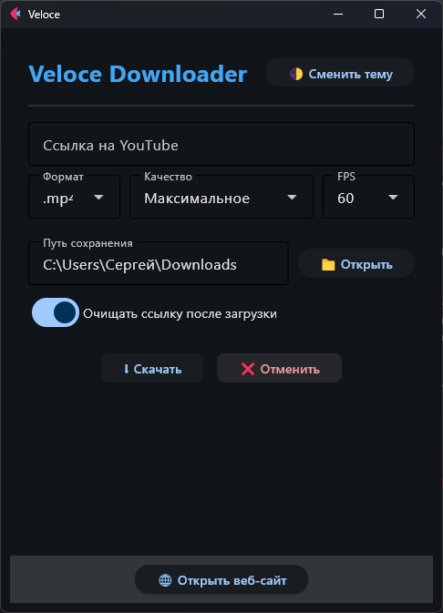
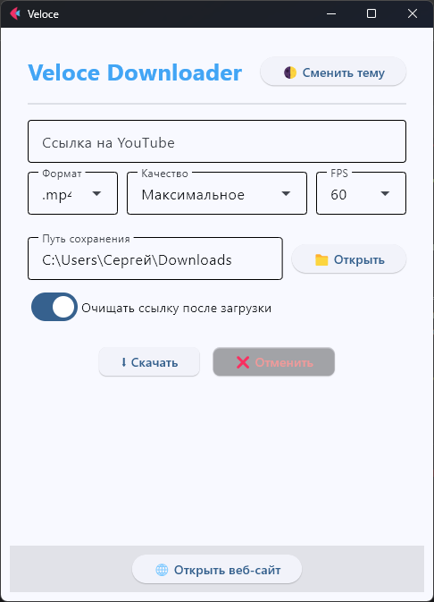

# 🚀 Veloce Media Downloader

**Veloce** — это быстрый и легкий десктопный загрузчик медиа-контента с YouTube, написанный на Python. Приложение сочетает в себе мощный бэкенд на базе `yt-dlp` и современный интерфейс, созданный с помощью фреймворка `Flet`.

Приложение работает в системном трее, автоматически отслеживает буфер обмена и поддерживает гибкую настройку качества, формата и пути сохранения файлов.

## ✨ Ключевые особенности

*   **🎨 Современный UI:** Интуитивно понятный интерфейс с поддержкой темной и светлой темы (Dark/Light Mode).
*   **📋 Smart Clipboard Monitor:** Автоматически распознает ссылки YouTube в буфере обмена и предлагает скачать видео через системное уведомление Windows.
*   **⚙️ Гибкие настройки загрузки:**
    *   Форматы: MP4, MP3, WAV.
    *   Качество видео: от 240p до 4K (включая выбор FPS: 30/60).
    *   Выбор папки сохранения через диалоговое окно или ручной ввод пути.
*   **🛠 Автономность:** При первом запуске автоматически скачивает и настраивает необходимые компоненты FFmpeg, не требуя ручной установки.
*   **💻 Системный трей:** Приложение сворачивается в трей, не занимая место на панели задач, и доступно по клику на иконку.
*   **🇷🇺 Умные предупреждения:** Автоматически определяет IP-адрес пользователя и предупреждает о возможных замедлениях YouTube в РФ, рекомендуя использование VPN.

## 📸 Скриншоты

### Интерфейс приложения




### Процесс работы


## 🛠 Технологический стек

*   **Python 3**
*   **Flet** — для кроссплатформенного GUI (на базе Flutter).
*   **yt-dlp** — ядро для загрузки и обработки медиа.
*   **FFmpeg** — для конвертации аудио/видео и склейки потоков.
*   **PyStray** — для интеграции в системный трей.
*   **Winotify** — для нативных Windows-уведомлений.
*   **Requests & Pyperclip** — для сетевых запросов и работы с буфером обмена.

## 📦 Установка и запуск

1.  Скачивание установщика:
    ```bash
      Скачайте .exe файл из realeses
    ```

2.  Установите зависимости:
    ```bash
       Установите программу открыв veloce-setup.exe
    ```

3.  Запустите приложение:
    ```bash
    Запустите veloce.exe и наслаждайтесь!
    ```

> **Примечание:** При первом запуске приложение может потребовать несколько секунд для автоматической загрузки бинарных файлов FFmpeg.

## 🤝 Contributing

Если вы нашли баг или хотите предложить новую функцию, создавайте Issue или Pull Request.

## 📄 License

Этот проект распространяется под лицензией MIT. Подробнее см. в файле [LICENSE](LICENSE).
